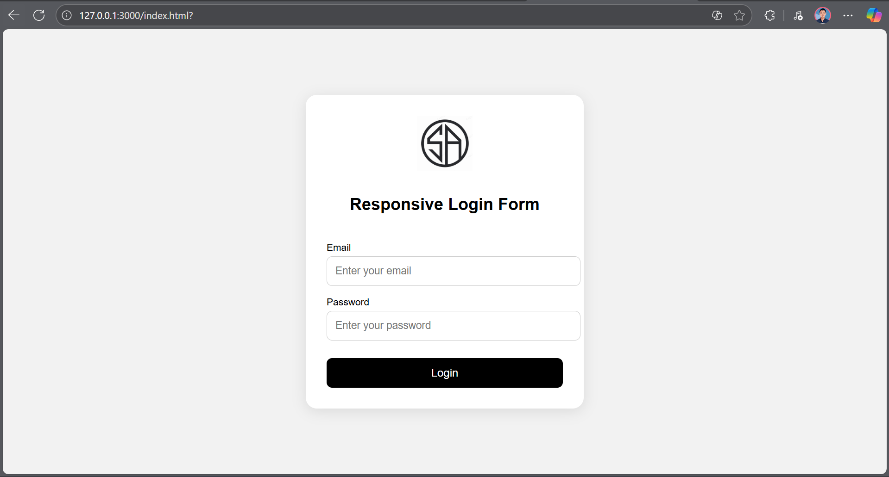

# Responsive Login Form

Project ini adalah contoh Responsive Login Form sederhana menggunakan HTML dan CSS.
Form ini dirancang untuk mudah digunakan, mobile-friendly, dan memiliki tampilan modern.

## Fitur

- Layout responsif, tampil rapi di desktop dan mobile.
- Input field dengan label dan placeholder untuk Email dan Password.
- Tombol Login yang jelas dan interaktif (hover effect).
- Box login dengan shadow dan border-radius agar terlihat modern.
- Tempat untuk menampilkan logo di atas form.

## Cara Menjalankan

- Clone atau download repository ini.
- Buka file index.html di browser favoritmu.
- Form akan tampil dan responsif di berbagai ukuran layar.

## Link Live
Gunakan link ini: https://salmanaf76.github.io/Responsive-Login-Form/

## Screenshot

